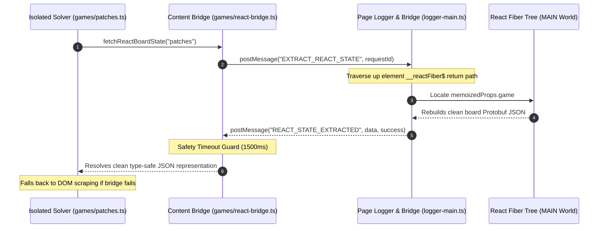
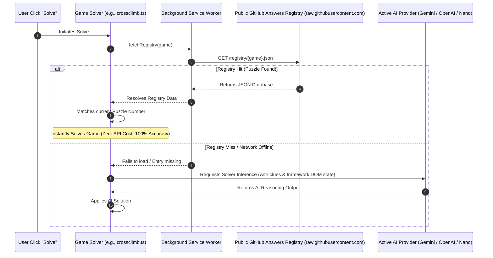

# 🎮 LinkedIn Games Solver

[](https://chromewebstore.google.com/detail/linkedin-games-solver/jnhgapnkejaijibcdhcldhdfikjmdaph)
[](https://chromewebstore.google.com/detail/linkedin-games-solver/jnhgapnkejaijibcdhcldhdfikjmdaph)
[](https://chromewebstore.google.com/detail/linkedin-games-solver/jnhgapnkejaijibcdhcldhdfikjmdaph)
[](LICENSE)

An advanced, obfuscation-proof browser extension compatible with Google Chrome™ built with **React**, **TypeScript**, and **Plasmo** that provides interactive overlays, education-centric helpers, and automated solvers for LinkedIn's daily games catalog.

<p align="left">
  <a href="https://chromewebstore.google.com/detail/linkedin-games-solver/jnhgapnkejaijibcdhcldhdfikjmdaph">
    
  </a>
</p>

> [!IMPORTANT]
>
> **Unofficial Educational Companion**: This is an independent, open-source educational project developed by [Muhammed Mustafa AKŞAM](https://github.com/muhammedaksam). It is **not** affiliated with, sponsored by, or endorsed by LinkedIn Corporation or its subsidiaries.

> [!TIP]
>
> **State-of-the-Art Architecture**: This extension features a **Main-World React Fiber State extraction bridge** that reads daily board states directly from LinkedIn's virtual tree, rendering the solver entirely immune to CSS class obfuscations or UI changes.

---

## 🚀 Key Features

- **Instant & Guided Solvers**: Instantly solve puzzles or receive step-by-step hints to learn best practices and strategies.
- **Obfuscation-Proof Engine**: Pulls board states, region matrices, relational edges, and constraints directly from React Fiber virtual tree properties rather than scraping fragile DOM coordinates.
- **Hybrid Registry / AI Solver**: Automatically fetches pre-solved daily trivia answers from a public registry, eliminating API token costs and LLM hallucinations for games like Crossclimb and Pinpoint. Falls back to active AI inference if needed.
- **Multi-Model AI Integration**: Uses advanced LLM reasoning (Gemini, Claude, GPT-4o, DeepSeek, or local Ollama) to solve new trivia-based games.
- **One-Click Contribution Engine**: Easily submit today's board states directly to our registry using the automated "Submit Answer" button, or copy the pre-formatted registry JSON in a single click for manual Pull Requests.
- **Human-like Pacing (Stealth Mode)**: Secure your daily streaks with custom pacing controls featuring randomized click delays, mimicking human patterns.
- **Detailed Activity Stats**: View streaks, average solve metrics, personal records, and visual activity calendar matrices.
- **Multilingual UI**: Native support for English and Turkish out of the box.

---

## 🛠️ Architecture & Extraction Bridge

The extension injects a Main-World (`logger-main.ts`) script that bypasses isolation sandboxing to query the React component virtual tree properties. When a solver triggers, it executes an asynchronous Promise-based IPC bridge to request and parse the underlying Protobuf schemas.

### React Fiber Bridge Flow



### Hybrid Answers Registry Flow

For trivia-based Ember.js games, the solver optimizes speed and stability through a public answer database, falling back dynamically to active AI models when needed:



---

## 🗃️ Daily Answers Registry & Contribution

To ensure lightning-fast solving speeds, prevent AI hallucinations on trivia-based games, and keep LLM token usage at absolute zero, the extension leverages a public registry database hosted on GitHub under `registry/`.

### Registry File Schemas

- **[crossclimb.json](file:///c:/Users/muhammed/Documents/GitHub/linkedin-games-solver/registry/crossclimb.json)**: Stores five-word ladder steps, starting/ending anchors, and clues mapped by the puzzle number.
- **[pinpoint.json](file:///c:/Users/muhammed/Documents/GitHub/linkedin-games-solver/registry/pinpoint.json)**: Stores categories and word clues mapped by the puzzle number.

#### Example Entry (`pinpoint.json`)

```json
{
  "758": {
    "category": "Words that come after \"door\"",
    "clues": ["Way", "Mat", "Bell", "Jamb", "Knob"]
  }
}
```

### 🤝 Easy Contribution (Help Keep Registry Up-to-Date!)

We want to make contributing daily puzzles as simple and accessible as possible. There are three easy ways you can contribute to keep the daily registry fully populated:

#### 🚀 Method 1: 1-Click Submit via Extension Debug Panel (Recommended)

This is the fastest, completely automated way to contribute:

1. Navigate to the active game board on LinkedIn (Crossclimb or Pinpoint).
2. Open the extension popup or side panel, and click on the **Debug** tab.
3. Scroll to the bottom and click the **"Submit Answer"** button.
4. This instantly launches a new tab to our GitHub repository's puzzle submission form, fully pre-filled with today's game type, puzzle ID, clues, and answers using URL query parameters!
5. Simply review the fields and click **"Submit new issue"**! Our automated GitHub Action pipeline will validate the entry, merge it into the registry, and credit you as a contributor automatically.

#### 🌟 Method 2: Manual Issue Template Submission

If you want to manually report a puzzle or type in the fields yourself:

1. Go to the **Issues** tab on our GitHub repository.
2. Click **New Issue** and select the **"Submit Daily Puzzle Answers"** template.
3. Fill out the simple form fields (Game Type, Clues, and Answers) using the board state from today's game.
4. Submit the issue! Our automated pipeline will do the rest and credit you as a co-author.

#### 🛠️ Method 3: Direct JSON Copy & Pull Request

If you prefer opening a manual Pull Request:

1. Navigate to the active game on LinkedIn.
2. Open the extension popup or side panel, and click on the **Debug** tab.
3. Scroll to the bottom and click **"Copy JSON"** (under today's registry JSON).
4. The extension extracts the daily board state, formats it to the exact schema, and copies the formatted JSON block to your clipboard.
5. Paste it directly into the respective registry file:
   - **[pinpoint.json](file:///c:/Users/muhammed/Documents/GitHub/linkedin-games-solver/registry/pinpoint.json)**
   - **[crossclimb.json](file:///c:/Users/muhammed/Documents/GitHub/linkedin-games-solver/registry/crossclimb.json)**

---

## 🎯 Supported Games & Capabilities

| Game           | Platform Framework |       Extraction Mode        |                    State Mapping Depth                     |     Fallback Stability     |
| :------------- | :----------------: | :--------------------------: | :--------------------------------------------------------: | :------------------------: |
| **Queens**     |      ⚛️ React      |       ⚡ Fiber Bridge        | Complete `colorGrid` region coordinates & existing guesses |   🟢 Active DOM Scraper    |
| **Tango**      |      ⚛️ React      |       ⚡ Fiber Bridge        |         Relational edge constraints & lock states          | 🟢 SVG Layout Calculations |
| **Zip**        |      ⚛️ React      |       ⚡ Fiber Bridge        |        Grid size checkpoint sequence & wall indices        |   🟢 Active DOM Scraper    |
| **Patches**    |      ⚛️ React      |       ⚡ Fiber Bridge        |   Clue sizes, shape bounds, and complete solution paths    |   🟢 Active DOM Scraper    |
| **Sudoku**     |    🐹 Ember.js     |        👁️ DOM Scraper        |    Direct input read-outs & aria accessibility parsing     |     🟢 Not Applicable      |
| **Crossclimb** |    🐹 Ember.js     | 👁️ DOM Scraper + 🗃️ Registry |        Active input values & candidate word arrays         | 🟢 100% LLM Reasoning Mode |
| **Pinpoint**   |    🐹 Ember.js     | 👁️ DOM Scraper + 🗃️ Registry |              Category hints & card text lists              | 🟢 100% LLM Reasoning Mode |

> [!NOTE]
>
> **Ember-based Games**: Sudoku, Pinpoint, and Crossclimb are built using Ember.js, which does not feature a virtual React state tree. The extension detects framework contexts automatically, logging descriptive skip events in diagnostics and successfully falling back to DOM scraper pipelines. For Pinpoint and Crossclimb, the extension first securely Queries the Public GitHub answers registry.

---

## 🛠️ Getting Started

<details>
<summary>📂 Development Installation & Quickstart</summary>

### 1. Clone & Install Dependencies

Ensure you have Node.js and `pnpm` installed on your machine.

```bash
# Clone the repository
git clone https://github.com/muhammedaksam/linkedin-games-solver.git
cd linkedin-games-solver

# Install packages
pnpm install
```

### 2. Start Development Server

```bash
pnpm dev
```

Open Chrome and navigate to `chrome://extensions`. Enable **Developer Mode**, click **Load Unpacked**, and select the `build/chrome-mv3-dev` directory in this workspace.

### 3. Production Compilation

```bash
pnpm build
```

The output will compile cleanly into the `build/chrome-mv3-prod` folder, ready for packing and uploading.

</details>

<details>
<summary>🎨 Generate Chrome Web Store & Social Assets</summary>

This repository includes an automatic generator for Web Store assets and social sharing cards, keeping social visual safe regions in check.

### Run Generator

```bash
pnpm generate:store-assets
```

### Outputs

- `store-assets/store-icon-128.png` — listing icon (128×128)
- `store-assets/global/small-promo-440x280.jpg` — small listing tile
- `store-assets/global/marquee-promo-1400x560.jpg` — marquee card
- `store-assets/global/screenshots/` — compiled localized screenshots (1280×800)
- `store-assets/social/social-1280x640.jpg` — global social sharing preview cards

### Prerequisites

- `rsvg-convert` — SVG rasterizer tool (`apt install librsvg2-bin` or via Homebrew)
- `ImageMagick` — Image composition engine (prefers the `magick` binary)
- `fontconfig` — Font utilities to auto-locate typography for localized CJK overlay texts.
</details>

---

## 🗺️ Extension Roadmap

- [x] **React Fiber Bridge Integration**: Zero-downtime, class-obfuscation proof virtual DOM scraping.
- [x] **Patches Game Support**: Fully integrated clue constraint extraction and layout drag simulators.
- [x] **Dynamic Selector Discovery**: Adaptive page element scanner supporting Ember.js and React contexts gracefully.
- [x] **Strict Type-Safety**: Generics-driven IPC messaging constraints.
- [x] **Localization Overhaul**: Support for multilingual UI strings and layouts.
- [x] **AI-Assisted Self-Solving Answers Registry**: Secure public pre-cached database for trivia-based games (Pinpoint & Crossclimb).
- [x] **Automated Registry Updates Pipeline**: CI/CD integration to auto-validate and append user-submitted daily game pull requests.

---

## 📄 License & Contribution

Contributions are extremely welcome! Feel free to open a Pull Request or report an issue.

Licensed under the terms of the [MIT License](LICENSE).

---

### ⚖️ Legal & Trademarks

_LinkedIn® and the [in]® logo are registered trademarks of LinkedIn Corporation and its affiliates in the United States and/or other countries. This extension is an independent, open-source educational project and is not affiliated with, endorsed by, or sponsored by LinkedIn Corporation._

_Google Chrome™, Chrome Web Store™, and Gemini™ are trademarks of Google LLC. Use of these trademarks is subject to [Google Permissions](https://about.google/brand-resource-center/guidance/)._
