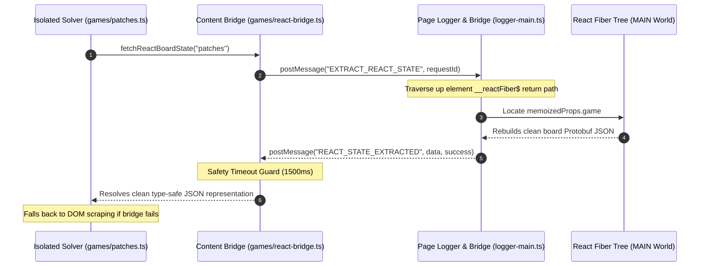

# 🎮 LinkedIn Games Solver

[](https://chromewebstore.google.com/detail/linkedin-games-solver/jnhgapnkejaijibcdhcldhdfikjmdaph)
[](https://chromewebstore.google.com/detail/linkedin-games-solver/jnhgapnkejaijibcdhcldhdfikjmdaph)
[](https://chromewebstore.google.com/detail/linkedin-games-solver/jnhgapnkejaijibcdhcldhdfikjmdaph)
[](LICENSE)

An advanced, obfuscation-proof browser extension compatible with Google Chrome™ built with **React**, **TypeScript**, and **Plasmo** that provides interactive overlays, education-centric helpers, and automated solvers for LinkedIn's daily games catalog.

<p align="left">
  <a href="https://chromewebstore.google.com/detail/linkedin-games-solver/jnhgapnkejaijibcdhcldhdfikjmdaph">
    
  </a>
</p>

> [!TIP]
>
> **State-of-the-Art Architecture**: This extension features a **Main-World React Fiber State extraction bridge** that reads daily board states directly from LinkedIn's virtual tree, rendering the solver entirely immune to CSS class obfuscations or UI changes.

---

## 🚀 Key Features

- **Instant & Guided Solvers**: Instantly solve puzzles or receive step-by-step hints to learn best practices and strategies.
- **Obfuscation-Proof Engine**: Pulls board states, region matrices, relational edges, and constraints directly from React Fiber virtual tree properties rather than scraping fragile DOM coordinates.
- **Multi-Model AI Integration**: Uses advanced LLM reasoning (Gemini, Claude, GPT-4o, DeepSeek, or local Ollama) to answer trivia-based games like Crossclimb and Pinpoint.
- **Human-like Pacing (Stealth Mode)**: Secure your daily streaks with custom pacing controls featuring randomized click delays, mimicking human patterns.
- **Detailed Activity Stats**: View streaks, average solve metrics, personal records, and visual activity calendar matrices.
- **Multilingual UI**: Native support for English and Turkish out of the box.

---

## 🛠️ Architecture & Extraction Bridge

The extension injects a Main-World (`logger-main.ts`) script that bypasses isolation sandboxing to query the React component virtual tree properties. When a solver triggers, it executes an asynchronous Promise-based IPC bridge to request and parse the underlying Protobuf schemas.



---

## 🎯 Supported Games & Capabilities

| Game           | Platform Framework | Extraction Mode |                    State Mapping Depth                     |     Fallback Stability     |
| :------------- | :----------------: | :-------------: | :--------------------------------------------------------: | :------------------------: |
| **Queens**     |      ⚛️ React      | ⚡ Fiber Bridge | Complete `colorGrid` region coordinates & existing guesses |   🟢 Active DOM Scraper    |
| **Tango**      |      ⚛️ React      | ⚡ Fiber Bridge |         Relational edge constraints & lock states          | 🟢 SVG Layout Calculations |
| **Zip**        |      ⚛️ React      | ⚡ Fiber Bridge |        Grid size checkpoint sequence & wall indices        |   🟢 Active DOM Scraper    |
| **Patches**    |      ⚛️ React      | ⚡ Fiber Bridge |   Clue sizes, shape bounds, and complete solution paths    |   🟢 Active DOM Scraper    |
| **Sudoku**     |    🐹 Ember.js     | 👁️ DOM Scraper  |    Direct input read-outs & aria accessibility parsing     |     🟢 Not Applicable      |
| **Crossclimb** |    🐹 Ember.js     | 👁️ DOM Scraper  |        Active input values & candidate word arrays         |     🟢 Not Applicable      |
| **Pinpoint**   |    🐹 Ember.js     | 👁️ DOM Scraper  |              Category hints & card text lists              |     🟢 Not Applicable      |

> [!NOTE]
>
> **Ember-based Games**: Sudoku, Pinpoint, and Crossclimb are built using Ember.js, which does not feature a virtual React state tree. The extension detects framework contexts automatically, logging descriptive skip events in diagnostics and successfully falling back to DOM scraper pipelines.

---

## 📦 Getting Started

<details>
<summary>📂 Development Installation & Quickstart</summary>

### 1. Clone & Install Dependencies

Ensure you have Node.js and `pnpm` installed on your machine.

```bash
# Clone the repository
git clone https://github.com/muhammedaksam/linkedin-games-solver.git
cd linkedin-games-solver

# Install packages
pnpm install
```

### 2. Start Development Server

```bash
pnpm dev
```

Open Chrome and navigate to `chrome://extensions`. Enable **Developer Mode**, click **Load Unpacked**, and select the `build/chrome-mv3-dev` directory in this workspace.

### 3. Production Compilation

```bash
pnpm build
```

The output will compile cleanly into the `build/chrome-mv3-prod` folder, ready for packing and uploading.

</details>

<details>
<summary>🎨 Generate Chrome Web Store & Social Assets</summary>

This repository includes an automatic generator for Web Store assets and social sharing cards, keeping social visual safe regions in check.

### Run Generator

```bash
pnpm generate:store-assets
```

### Outputs

- `store-assets/store-icon-128.png` — listing icon (128×128)
- `store-assets/global/small-promo-440x280.jpg` — small listing tile
- `store-assets/global/marquee-promo-1400x560.jpg` — marquee card
- `store-assets/global/screenshots/` — compiled localized screenshots (1280×800)
- `store-assets/social/social-1280x640.jpg` — global social sharing preview cards

### Prerequisites

- `rsvg-convert` — SVG rasterizer tool (`apt install librsvg2-bin` or via Homebrew)
- `ImageMagick` — Image composition engine (prefers the `magick` binary)
- `fontconfig` — Font utilities to auto-locate typography for localized CJK overlay texts.
</details>

---

## 🗺️ Extension Roadmap

- [x] **React Fiber Bridge Integration**: Zero-downtime, class-obfuscation proof virtual DOM scraping.
- [x] **Patches Game Support**: Fully integrated clue constraint extraction and layout drag simulators.
- [x] **Dynamic Selector Discovery**: Adaptive page element scanner supporting Ember.js and React contexts gracefully.
- [x] **Strict Type-Safety**: Generics-driven IPC messaging constraints.
- [x] **Localization Overhaul**: Support for multilingual UI strings and layouts.
- [ ] **AI-Assisted Self-Solving Offline Cache**: Pre-cached solutions for trivia-based games.

---

## 📄 License & Contribution

Contributions are extremely welcome! Feel free to open a Pull Request or report an issue.

Licensed under the terms of the [MIT License](LICENSE).

---

### ⚖️ Legal & Trademarks

_LinkedIn™ is a trademark of LinkedIn Corporation and its affiliates in the United States and/or other countries. This extension is an independent project and is not affiliated with, endorsed by, or sponsored by LinkedIn Corporation._

_Google Chrome™, Chrome Web Store™, and Gemini™ are trademarks of Google LLC. Use of these trademarks is subject to [Google Permissions](https://about.google/brand-resource-center/guidance/)._
